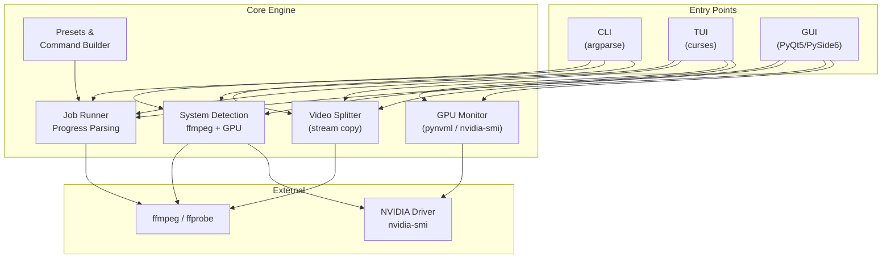
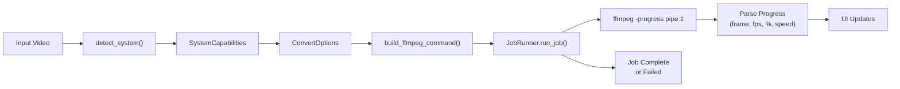
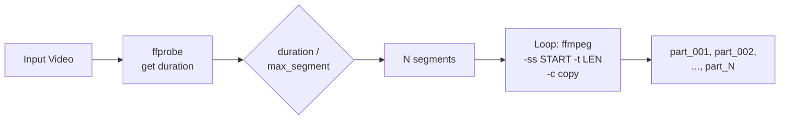
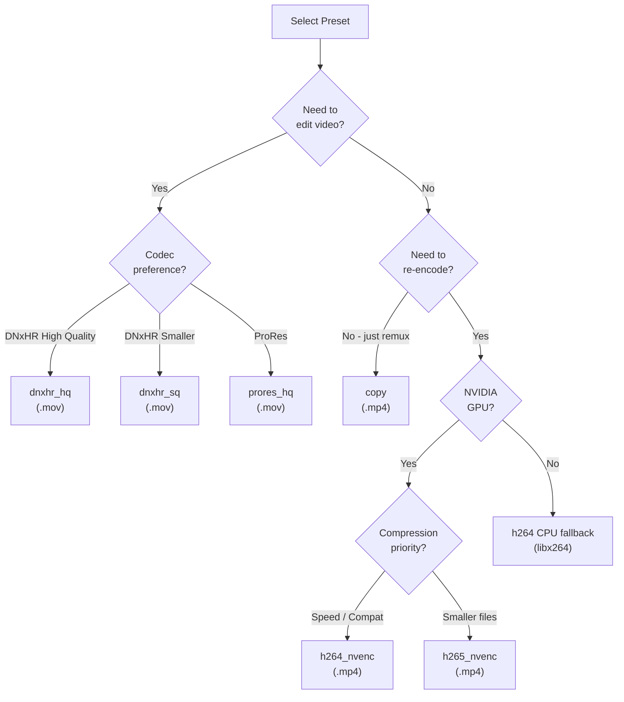

# VideoTool

A Linux video-conversion and splitting utility with **GUI**, **TUI**, and **CLI** interfaces. Built as a single Python script wrapping `ffmpeg`, designed for converting videos into edit-friendly formats (DNxHR/ProRes) and delivery formats (H.264/H.265 via NVENC), plus splitting long videos into segments without quality loss.

---

## Screenshots

<!-- Add your screenshots here -->

| GUI - System Detection | GUI - Convert Tab |
|:---:|:---:|
|  |  |

| GUI - Progress Tab | GUI - Split / Cut Tab |
|:---:|:---:|
|  |  |

---

## Features

- **7 Conversion Presets** -- DNxHR HQ/SQ, ProRes HQ, H.264/H.265 NVENC, Stream Copy, Audio PCM
- **Video Splitter** -- Cut videos into equal segments by max duration (no re-encode, zero quality loss)
- **NVIDIA GPU Auto-Detection** -- Detects NVENC, uses GPU encoding when available, falls back to CPU
- **Real-Time GPU Monitoring** -- Live GPU utilization and memory usage during encoding
- **Batch Processing** -- Process entire folders of videos at once
- **Three Interfaces** -- Full-featured GUI (PyQt5/PySide6), TUI (curses), and CLI
- **Dry Run Mode** -- Preview ffmpeg commands before executing
- **Job Reports** -- Export conversion history as JSON or CSV

---

## Architecture



### Conversion Flow



### Video Split Flow



### Preset Decision Tree



---

## Installation

### Requirements

| Dependency | Required | Purpose |
|:---|:---:|:---|
| Python 3.10+ | Yes | Runtime |
| ffmpeg | Yes | Video encoding/splitting |
| PyQt5 or PySide6 | No | GUI mode |
| pynvml | No | Better GPU monitoring |
| psutil | No | System resource info |

```bash
# Install ffmpeg (Ubuntu/Debian)
sudo apt install ffmpeg

# Install Python dependencies
pip install -r requirements.txt
```

### Setup

```bash
git clone <repo-url>
cd Video_Converter_Tool
pip install -r requirements.txt
chmod +x videotool.py
```

---

## Usage

### GUI (default)

```bash
./videotool.py            # Launches GUI by default
./videotool.py gui        # Explicit GUI launch
```

**Tabs:** System/Detection | Convert | Progress | History | Split/Cut

### TUI (Terminal UI)

```bash
./videotool.py tui
```

**Keys:**
| Key | Action |
|:---:|:---|
| `C` | Convert screen |
| `S` | Split screen |
| `H` | Job history |
| `D` | Save detection JSON |
| `Q` | Quit |
| `I` | Set input file/folder |
| `O` | Set output directory |
| `Up/Down` | Change preset or split duration |
| `Enter` | Start operation |
| `Esc` | Back to main |

### CLI -- Convert

```bash
# Single file
./videotool.py convert -p dnxhr_hq -i clip.mp4 -o edit_clip.mov

# GPU-accelerated export
./videotool.py convert -p h264_nvenc -i clip.mp4 -o export.mp4

# Batch process a folder
./videotool.py convert -p dnxhr_hq -i /videos/ -O /output/ --batch

# Dry run (preview commands)
./videotool.py convert -p h265_nvenc -i clip.mp4 -o out.mp4 --dry-run

# With custom options
./videotool.py convert -p h264_nvenc -i clip.mp4 -o out.mp4 \
    --resolution 1920x1080 --fps 24 --cq 19 --audio-bitrate 192k
```

### CLI -- Split

```bash
# Split a 10-min video into 2-min segments
./videotool.py split -i long_video.mp4 -d 2

# Split with custom output directory
./videotool.py split -i long_video.mp4 -d 3 -O /output/parts/
```

**Output:** `long_video_part001.mp4`, `long_video_part002.mp4`, ..., `long_video_part005.mp4`

> Split uses stream copy (`-c copy`) so there is **no re-encoding** and **no quality loss**. It's near-instant.

### CLI -- Detect

```bash
./videotool.py detect    # Print hardware/ffmpeg capabilities as JSON
```

---

## Presets Reference

| Preset | Codec | Container | GPU | Use Case |
|:---|:---|:---:|:---:|:---|
| `dnxhr_hq` | DNxHR HQ | .mov | No | Edit-friendly for DaVinci Resolve |
| `dnxhr_sq` | DNxHR SQ | .mov | No | Smaller edit-friendly |
| `prores_hq` | ProRes HQ | .mov | No | Decode-friendly editing |
| `h264_nvenc` | H.264 (NVENC) | .mp4 | Yes | Fast GPU export, wide compatibility |
| `h265_nvenc` | H.265 (NVENC) | .mp4 | Yes | GPU export, better compression |
| `copy` | Stream copy | .mp4 | No | Remux only, no re-encode |
| `audio_pcm` | Video copy + PCM | .mov | No | Fix audio for Resolve |

---

## Project Structure

```
Video_Converter_Tool/
├── videotool.py          # Single-file application (~2190 lines)
├── requirements.txt      # Python dependencies
├── README.md
├── llm_memory.md         # Compressed project knowledge for LLM context
└── screenshots/
    ├── HOME.png          # GUI - System Detection
    ├── CONVERT.png       # GUI - Convert Tab
    ├── PROGRESS.png      # GUI - Progress Tab
    └── SPLIT.png         # GUI - Split / Cut Tab
```

---

## Logs

Logs are stored at:

```
~/.videotool/logs/videotool_YYYYMMDD_HHMMSS.log
```

---

## License

This project is open source. See [LICENSE](LICENSE) for details.
