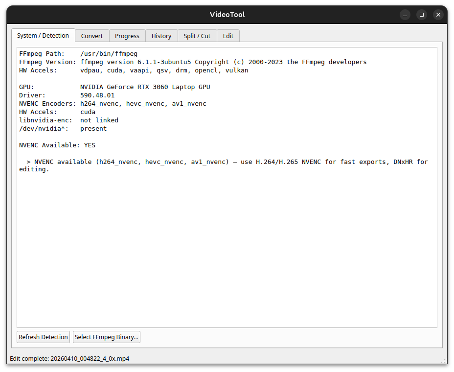
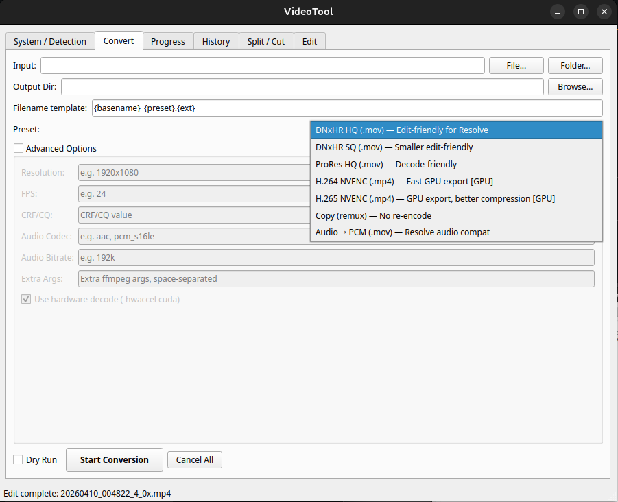
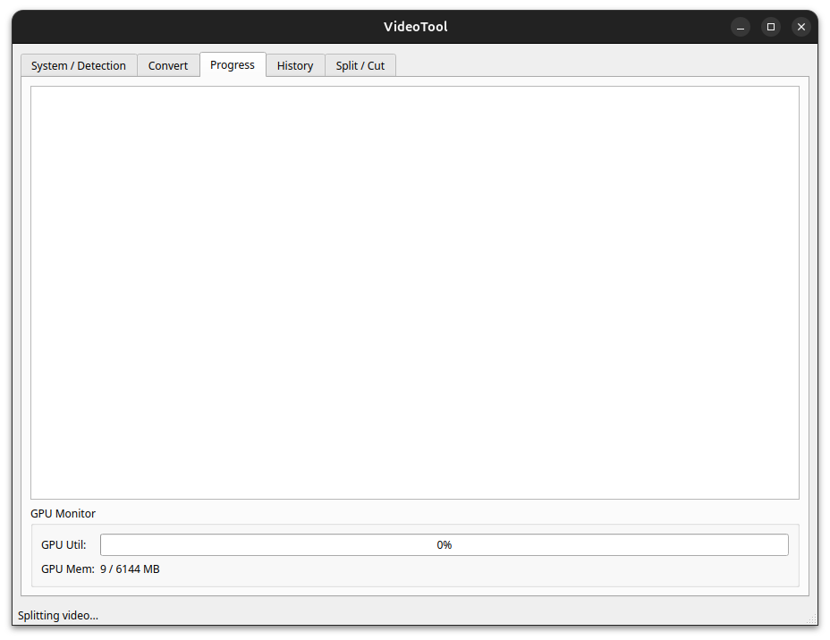
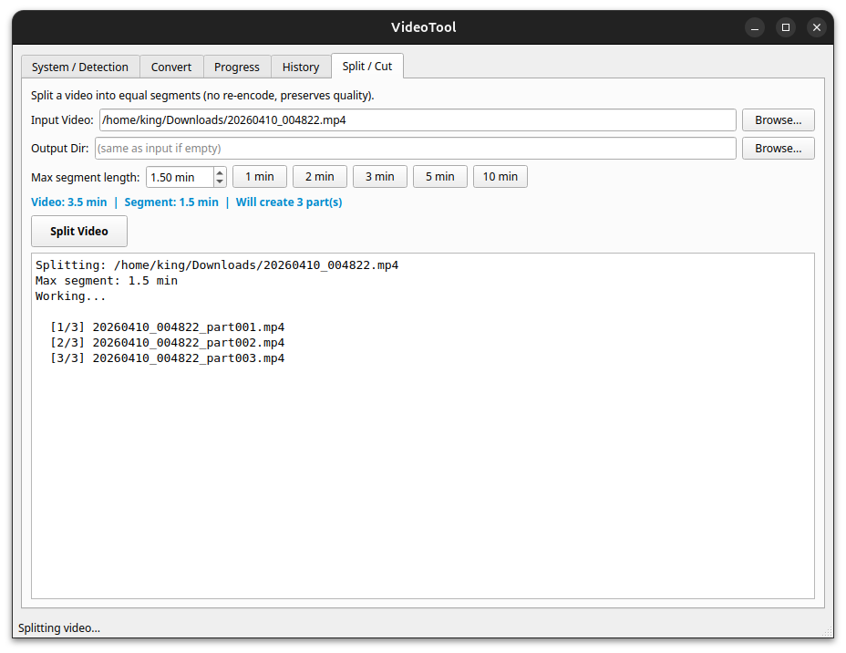
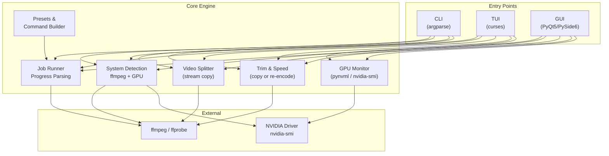
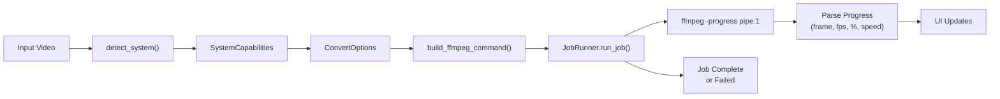
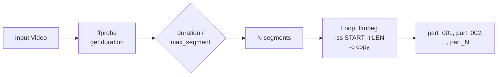
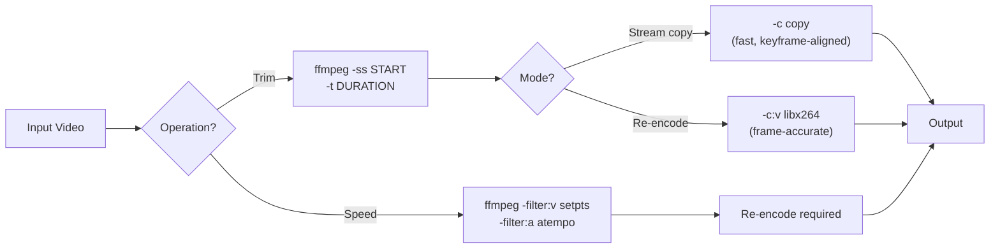
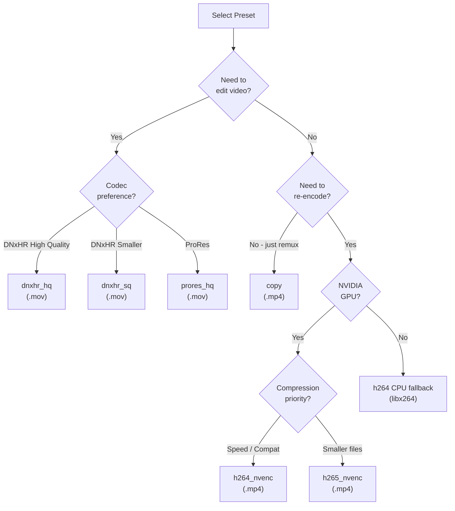

# VideoTool

**A fast, no-nonsense video tool built for Linux** -- because the existing "full-featured" tools on Linux either crash, run slow, have broken UIs, or just don't do what you need them to do. So I built my own.

This is a single Python script wrapping `ffmpeg` that does exactly what I need: **convert**, **split**, **trim**, and **speed-change** videos with proper GPU acceleration, no bloat, and three interfaces (GUI, TUI, CLI) so it works however you prefer.

---

## Why This Exists

Linux has plenty of video tools -- Handbrake, Kdenlive, Shotcut, online converters -- but in practice:
- Online tools cap you at **2-3 min max** video length
- GUI tools crash randomly or take forever to configure
- Most don't properly leverage **NVIDIA NVENC** for fast exports
- Simple tasks like "split this 10-min video into 2-min parts" require way too many steps
- Speed changes and quick trims shouldn't need a full NLE timeline

VideoTool fixes all of this. One script, fast GPU encoding, splits/trims in seconds with zero quality loss, and it just works.

---

## Screenshots

| GUI - System Detection | GUI - Convert Tab |
|:---:|:---:|
|  |  |

| GUI - Progress Tab | GUI - Split / Cut Tab |
|:---:|:---:|
|  |  |

<!-- Add new screenshots here as you take them -->
<!-- | GUI - Edit Tab | TUI |  -->
<!-- |:---:|:---:| -->
<!-- |  |  | -->

---

## Features

### Core
- **7 Conversion Presets** -- DNxHR HQ/SQ, ProRes HQ, H.264/H.265 NVENC, Stream Copy, Audio PCM
- **Video Splitter** -- Split videos into equal segments by max duration (M:SS input, no re-encode, zero quality loss, near-instant)
- **Video Trimmer** -- Cut a portion of video by start/end time, stream copy (fast) or re-encode (frame-accurate)
- **Speed Changer** -- 0.25x to 100x playback speed with proper audio pitch correction

### Speed & GPU
- **NVIDIA NVENC Auto-Detection** -- Detects your GPU, uses hardware encoding when available, auto-falls back to CPU
- **Real-Time GPU Monitoring** -- Live GPU utilization and memory usage during encoding
- **Stream Copy Operations** -- Split and trim use `-c copy` by default: no re-encoding means **instant results with zero quality loss**
- **Batch Processing** -- Drop a folder, convert everything in one go

### Interfaces
- **GUI** (PyQt5/PySide6) -- Full-featured with 6 tabs: Detection, Convert, Progress, History, Split/Cut, Edit
- **TUI** (curses) -- Terminal UI for SSH/headless use with all features
- **CLI** (argparse) -- Scriptable commands for automation and pipelines

### Extras
- **Dry Run Mode** -- Preview exact ffmpeg commands before executing
- **Job Reports** -- Export conversion history as JSON or CSV
- **Video Thumbnail Preview** -- Edit tab shows video thumbnail + opens in system player
- **Duration input as M:SS** -- No confusing decimal minutes, type `1:30` for 1 min 30 sec

---

## Architecture



### Conversion Flow



### Video Split Flow



### Edit Flow (Trim / Speed)



### Preset Decision Tree



---

## Installation

### Requirements

| Dependency | Required | Purpose |
|:---|:---:|:---|
| Python 3.10+ | Yes | Runtime |
| ffmpeg | Yes | Video encoding/splitting/trimming |
| PyQt5 or PySide6 | No | GUI mode |
| pynvml | No | Better GPU monitoring |
| psutil | No | System resource info |

```bash
# Install ffmpeg (Ubuntu/Debian)
sudo apt install ffmpeg

# Install Python dependencies
pip install -r requirements.txt
```

### Setup

```bash
git clone <repo-url>
cd Video_Converter_Tool
pip install -r requirements.txt
chmod +x videotool.py
```

---

## Usage

### GUI (default)

```bash
./videotool.py            # Launches GUI by default
./videotool.py gui        # Explicit GUI launch
```

**Tabs:** System/Detection | Convert | Progress | History | Split/Cut | Edit

### TUI (Terminal UI)

```bash
./videotool.py tui
```

**Keys:**
| Key | Action |
|:---:|:---|
| `C` | Convert screen |
| `S` | Split screen |
| `E` | Edit screen (Trim / Speed) |
| `H` | Job history |
| `D` | Save detection JSON |
| `Q` | Quit |
| `I` | Set input file/folder |
| `O` | Set output directory |
| `Up/Down` | Change preset, duration, or speed |
| `Enter` | Start operation |
| `Esc` | Back to main |

### CLI -- Convert

```bash
# Single file
./videotool.py convert -p dnxhr_hq -i clip.mp4 -o edit_clip.mov

# GPU-accelerated export
./videotool.py convert -p h264_nvenc -i clip.mp4 -o export.mp4

# Batch process a folder
./videotool.py convert -p dnxhr_hq -i /videos/ -O /output/ --batch

# Dry run (preview commands)
./videotool.py convert -p h265_nvenc -i clip.mp4 -o out.mp4 --dry-run

# With custom options
./videotool.py convert -p h264_nvenc -i clip.mp4 -o out.mp4 \
    --resolution 1920x1080 --fps 24 --cq 19 --audio-bitrate 192k
```

### CLI -- Split

```bash
# Split a 10-min video into 2-min segments (use M:SS format)
./videotool.py split -i long_video.mp4 -d 2:00

# 1 min 30 sec segments
./videotool.py split -i long_video.mp4 -d 1:30

# Split with custom output directory
./videotool.py split -i long_video.mp4 -d 3:00 -O /output/parts/
```

**Output:** `long_video_part001.mp4`, `long_video_part002.mp4`, ..., `long_video_part005.mp4`

> Split uses stream copy (`-c copy`) -- **no re-encoding, zero quality loss, near-instant**.

### CLI -- Trim

```bash
# Trim from 1:30 to 3:00 (stream copy, fast)
./videotool.py trim -i video.mp4 -s 1:30 -e 3:00

# Trim with re-encode for frame-accurate cuts
./videotool.py trim -i video.mp4 -s 0:45 -e 2:15 --reencode

# Custom output path
./videotool.py trim -i video.mp4 -s 0:00 -e 1:00 -o first_minute.mp4
```

### CLI -- Speed

```bash
# 2x speed
./videotool.py speed -i video.mp4 -x 2.0

# Slow motion (half speed)
./videotool.py speed -i video.mp4 -x 0.5

# 4x speed with custom output
./videotool.py speed -i video.mp4 -x 4.0 -o fast_version.mp4
```

> Speed change requires re-encoding. Audio pitch is corrected automatically via chained `atempo` filters.

### CLI -- Detect

```bash
./videotool.py detect    # Print hardware/ffmpeg capabilities as JSON
```

---

## Presets Reference

| Preset | Codec | Container | GPU | Use Case |
|:---|:---|:---:|:---:|:---|
| `dnxhr_hq` | DNxHR HQ | .mov | No | Edit-friendly for DaVinci Resolve |
| `dnxhr_sq` | DNxHR SQ | .mov | No | Smaller edit-friendly |
| `prores_hq` | ProRes HQ | .mov | No | Decode-friendly editing |
| `h264_nvenc` | H.264 (NVENC) | .mp4 | Yes | Fast GPU export, wide compatibility |
| `h265_nvenc` | H.265 (NVENC) | .mp4 | Yes | GPU export, better compression |
| `copy` | Stream copy | .mp4 | No | Remux only, no re-encode |
| `audio_pcm` | Video copy + PCM | .mov | No | Fix audio for Resolve |

---

## Project Structure

```
Video_Converter_Tool/
├── videotool.py          # Single-file application (~2920 lines)
├── requirements.txt      # Python dependencies
├── README.md
├── llm_memory.md         # Compressed project knowledge for LLM context
└── screenshots/
    ├── HOME.png          # GUI - System Detection
    ├── CONVERT.png       # GUI - Convert Tab
    ├── PROGRESS.png      # GUI - Progress Tab
    └── SPLIT.png         # GUI - Split / Cut Tab
```

> Take more screenshots? Drop them in `screenshots/` and add rows to the Screenshots table above.

---

## Logs

Logs are stored at:

```
~/.videotool/logs/videotool_YYYYMMDD_HHMMSS.log
```

---

## License

This project is open source. See [LICENSE](LICENSE) for details.
